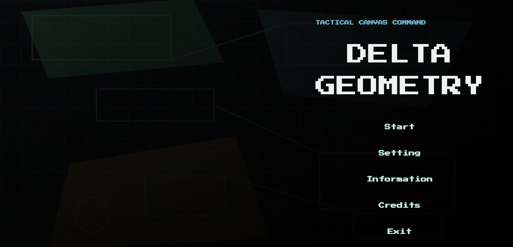
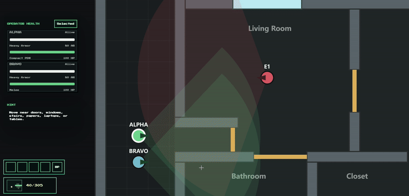
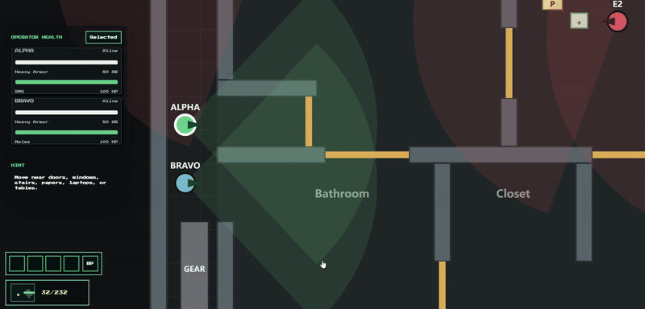
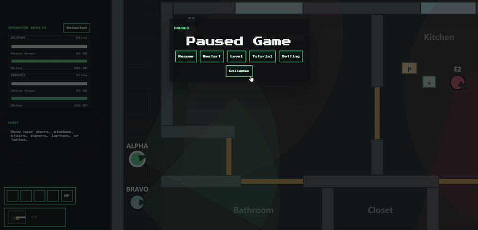

# Delta Geometry

A top-down tactical breach game built around precise movement, stealth, adaptive enemies, and interactive missions.



## Overview

Delta Geometry is a browser-based tactical action game where players command one or more operators through enclosed combat environments. Choose equipment, enter a mission, move and aim directly, manage threats, interact with the environment, and secure the objective while keeping the team alive.

The game runs on desktop browsers and uses HTML, CSS, JavaScript, Canvas 2D, and Web Audio. Missions combine close-quarters combat, stealth, inventory management, doors, windows, digital locks, stairs, cameras, equipment tables, and VIP objectives.

## Key Features

* Tactical automatic and manual combat
* Individual enemy detection, suspicion, alert, search, and teamwork behavior
* Persistent enemy action learning in Difficult mode
* Inventory, hotbar, consumables, disguises, and operator loadouts
* Six tutorials and six sequential story missions
* Interactive doors, windows, stairs, locks, laptops, cameras, and objectives
* Built-in Map Editor with an unsaved movement simulation
* Advanced Dev Settings for mission, loadout, enemy, and algorithm controls
* Procedurally generated music and sound effects using the Web Audio API

## Gameplay

Move the selected operator with `WASD`. The operator continuously aims toward the mouse cursor on the game canvas. In Manual shooting mode, hold the left mouse button to fire and release it to stop. In Automatic mode, the operator engages visible targets according to the current weapon, range, and line of sight.

Use `E` near doors, windows, stairs, papers, equipment tables, laptops, and other interactive objects. Open the inventory with `Tab` to inspect, use, move, or drop carried items. Hold Left Alt while moving to sneak, or Left Shift to sprint. Operators can switch weapons and armor, carry healing items, use a lighter in Difficult mode, and wear clothes taken from a melee-neutralized enemy as a disguise.

A mission succeeds when its required objective is secured. It fails if all operators are down or the protected objective is compromised. Successful story missions award score, unlock the next level, and allow the player to continue through the Store.

## Game Systems

### Enemy Algorithm



Enemies maintain individual awareness states. They can detect operators, become suspicious, enter combat alert, search a last-known position, calm down, and trigger a later alert only after suspicion has fallen sufficiently. Nearby enemies can share pressure, support one another, leave patrol areas, and open doors while searching in Difficult mode.

Enemy personalities modify those decisions:

* **Aggressive** enemies pursue threats and investigate the origin of non-silent sounds.
* **Calm** enemies favor defensive positions and may retreat when their defense collapses.
* **Loyal** enemies continue defending even after losing teammates.
* **Violent** enemies attack recklessly with less concern for themselves or nearby defenders.

In Difficult mode, enemies choose between shooting, retreating, and calling support. Actions that contribute to operator damage gain selection weight across future sessions. A separate session-based weapon possibility system adjusts the chance of stronger enemy weapons and armor according to story mission results.

### Approaches



Players can approach a mission in several ways:

* **Direct attack:** breach doors, use rifles, SMGs, or pistols, and control the fight through line of sight and positioning.
* **Stealth attack:** use the silenced pistol to neutralize enemies without broadcasting the shot to nearby defenders.
* **Melee assassination:** neutralize an enemy quietly at close range without disturbing the rest of the defense.
* **Disguise:** collect enemy clothes from a melee-neutralized target and remain unnoticed until the disguised operator damages an enemy.

Doors can be opened, closed, breached, and used to control sight lines. Windows can be opened, vaulted, broken, or fired through. Inventory items and environmental information provide additional ways to prepare before engaging.

### Map Editor & Dev Settings



The Map Editor under `tools/map-editor/` provides a large canvas for custom level layouts. Designers can place and drag walls, doors, windows, operators, enemies, objectives, labels, stairs, equipment tables, and clues. It also supports opening existing JSON levels, deleting objects, clearing or closing a map, panning, zooming, downloading JSON, and launching an unsaved movement simulation for walls and doors.

Dev Settings provide advanced controls inside the game for mission setup, operator loadouts, enemy loadouts, enemy personalities, enemy learning, and Difficult-mode weapon possibility. Outside the Start menu, open General Settings, select Dev Mode, and enter the secret phrase `Let me in`.

## Controls

| Action | Default control |
| ------ | --------------- |
| Move | `W`, `A`, `S`, `D` |
| Aim | Move mouse over the game canvas |
| Fire in Manual mode | Hold left mouse button |
| Stop firing | Release left mouse button |
| Interact | `E` |
| Open or close inventory | `Tab` |
| Reload | `R` |
| Switch operator | `H` |
| Sneak | Hold Left Alt |
| Sprint | Hold Left Shift |
| Open Settings or Pause | `Esc` |

Keyboard controls can be remapped from General Settings.

## Levels

The six tutorials introduce the game systems in focused stages:

1. Basics Movement
2. Digital Lock
3. Equipment Table
4. Operators And Stairs
5. Shooting Modes
6. Windows

The six story missions expand those mechanics into complete tactical challenges:

1. Camera House
2. Hardpoint Gallery
3. House Blueprint
4. Ridge House Entry
5. Terminal Breach
6. Warehouse Pinch

Story levels unlock sequentially after the previous mission is completed successfully. Tutorial progress and story completion are saved between play sessions.

## Development Status

* [x] Overall completed

## Installation and Launch

### Local server

Install a current Node.js LTS release, open PowerShell in the project folder, and run:

```powershell
npm start
```

Then open:

```text
http://127.0.0.1:4700/
```

The server can also be started directly:

```powershell
node server.js
```

No third-party npm packages are required. The local server uses built-in Node.js modules to serve the game and detect story level JSON files when the server starts.

### Standalone demo

Open `demo/index.html` directly in a desktop browser. The demo keeps its playable data, CSS, and JavaScript local and does not require a localhost server.

## Credits

* Development: Tech-FireFish
* Art design: Tech-FireFish
* Game design: Tech-FireFish
* UI design: Tech-FireFish
* Level design: Tech-FireFish
* Tutorial design: Tech-FireFish
* Engineering: Tech-FireFish
* Music and sound effects: Procedural Web Audio
* Tools and libraries: HTML, CSS, JavaScript, Canvas 2D, Web Audio API, and Node.js
* Typeface: Press Start 2P

## Demo

The standalone `demo/` snapshot is intended for local presentation and quick testing without a server. Open `demo/index.html` directly and use a desktop browser. The root game remains the authoritative development version and includes restart-time level discovery through its Node.js server.

## Troubleshooting

### Chrome gameplay or scrolling feels jumpy

Enable **Use graphics acceleration when available** in Chrome settings, restart the browser, and try the game again. Hardware acceleration allows Chrome to move suitable canvas, compositing, and rendering work from the CPU to the GPU.

Also close unnecessary high-load tabs and confirm the browser is not running in a power-saving mode. Microsoft Edge or another Chromium browser can be used as a comparison when diagnosing browser-specific performance.
